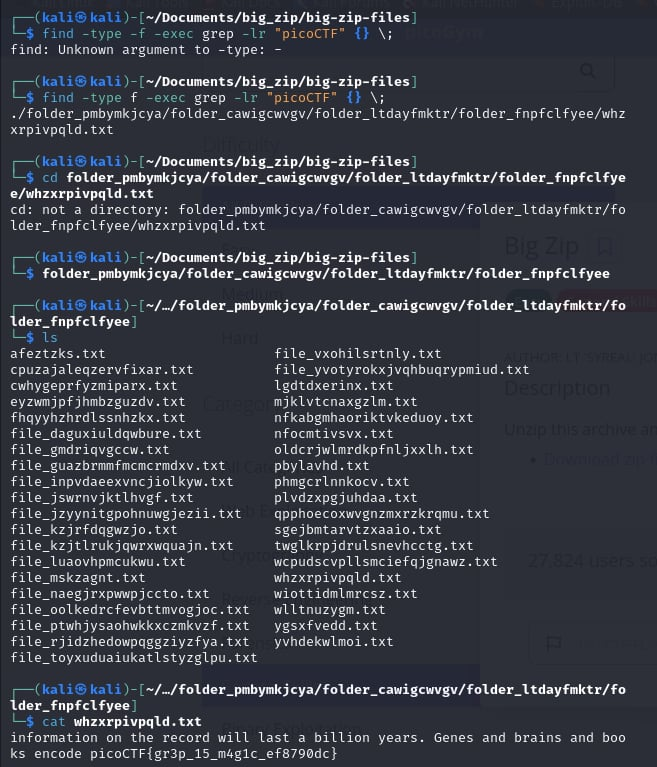
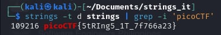
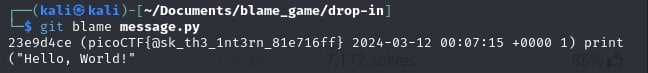
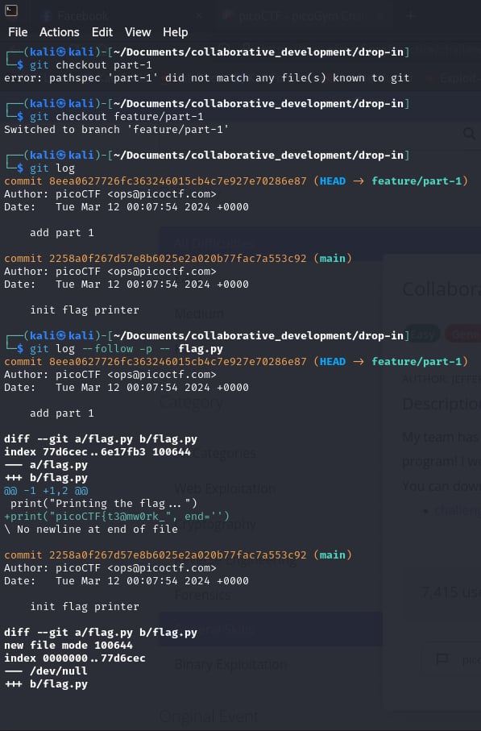
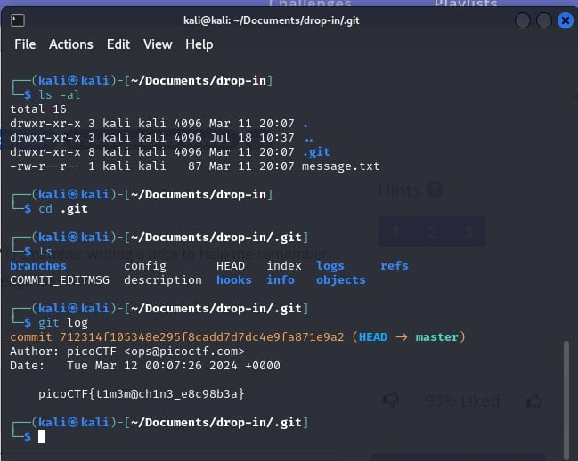
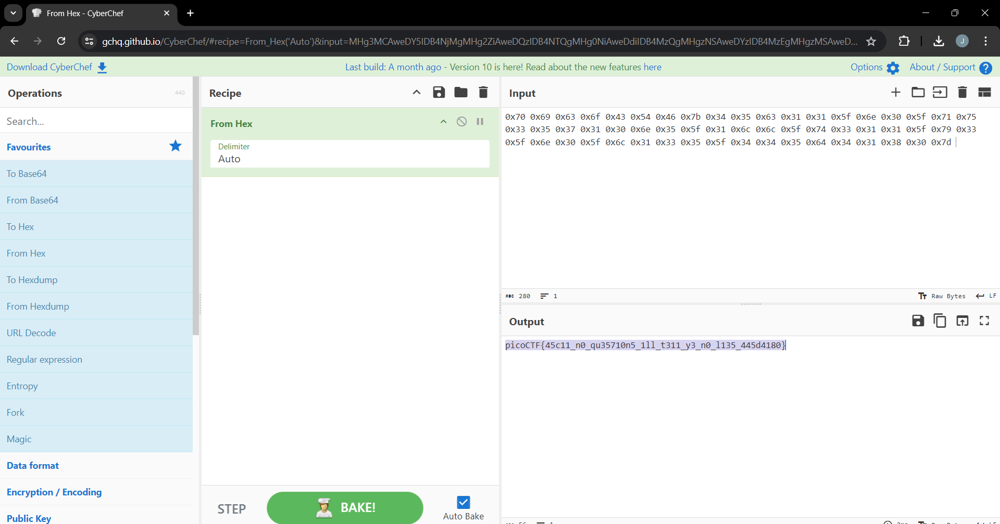

# Finding File in Directories and Sub-Directories Command

<!-- #### ``find . -name uber-secret.txt`` -->
#### find . -name uber-secret.txt

## Example

## References

- [How To Find a File In Linux From the Command Line](https://www.plesk.com/blog/various/find-files-in-linux-via-command-line/)

################################################################################################################################

# Find all Files Containing Specific Text (string) Command

<!-- #### ``find -type f -exec grep -lr "picoCTF" {} \;`` -->
#### find -type f -exec grep -lr "picoCTF" {} \;

## Example

## References

- [How to Find all Files Containing Specific Text (string) on Linux](https://www.geeksforgeeks.org/how-to-find-all-files-containing-specific-text-string-on-linux/)

################################################################################################################################

# Find Text (string) in a File Command

<!-- #### ``grep 'picoCTF' file;`` -->
#### grep 'picoCTF' file;

## Example

## References

- [grep command in Unix/Linux](https://www.geeksforgeeks.org/grep-command-in-unixlinux/)

################################################################################################################################

# Finding Strings From Binary Files Command

<!-- #### ``grep 'picoCTF' file;`` -->
#### strings -t d strings | grep -i 'picoCTF'

## Example

## References

- [Finding Strings From Binary Files in Linux](https://www.baeldung.com/linux/find-string-binary-file#:~:text=Using%20the%20od%20Command,%2C%20hexadecimal%2C%20or%20ASCII%20format.&text=From%20the%20output%20above%2C%20we,the%20same%2C%20as%20we%20expected.)

################################################################################################################################

# Find the Commit which Introduced a Bug command

<!-- #### ``git blame message.py`` -->
#### git blame message.py

## Example

## References

- [How to find the commit which introduced a bug](https://github.com/oppia/oppia/wiki/How-to-find-the-commit-which-introduced-a-bug)

################################################################################################################################

# Git Commands

<!-- #### ``git branch -a`` - Shows all the local and remote branches -->
#### git branch -a - Shows all the local and remote branches

<!-- #### ``git checkout feature/part-1`` - Switch to that branch -->
#### git checkout feature/part-1 - Switch to that branch

<!-- #### ``git log`` - Show commit history -->
#### git log - Show commit history

<!-- #### ``git log --follow -p -- flag.py`` - Show changes in a file -->
#### git log --follow -p -- flag.py - Show changes in a file

## Example

## References

- [Git checkout](https://www.atlassian.com/git/tutorials/using-branches/git-checkout?utm_source=gdn&utm_medium=paid-display&campaign=21252494340&adgroup=&device=c&devicemodel=&placement=&aceid=&creative=&adtype=&gclid=Cj0KCQjw-uK0BhC0ARIsANQtgGPVKyUlasCZ4XNFUE7wpdPkOxeA_5JKpWka_huVspPhbyUMCMhOHxIaAh7REALw_wcB&country=&network=x&targetid=&gad_source=1)
- [See changes to a specific file using git](https://stackoverflow.com/questions/8048584/see-changes-to-a-specific-file-using-git)

################################################################################################################################

# Show Hidden Files Command

<!-- #### ``ls -al``  -->
#### ls -al

## Example

################################################################################################################################

# Tools

## - [CyberChef](https://gchq.github.io/CyberChef/)

<!--  -->

########################################################################

## - [BASE64 Decode and Encode](https://www.base64decode.org/)

<!--  -->

########################################################################

## - [Binary Calculator](https://www.calculator.net/binary-calculator.html?number1=11001010&c2op=%2B&number2=01101010&calctype=op&x=Calculate)

########################################################################

## - [Bitwise Calculator](https://miniwebtool.com/bitwise-calculator/)

########################################################################

## - [Binary to Hex converter](https://www.rapidtables.com/convert/number/binary-to-hex.html?x=110010100)

########################################################################

## - [ASCII Text to Hex Code Converter](https://www.rapidtables.com/convert/number/ascii-to-hex.html)

########################################################################

## - [Decimal to Text Converter](https://onlinetexttools.com/convert-decimal-to-text)

########################################################################

## - [ MD5 Hash Generator](https://www.md5hashgenerator.com/)

########################################################################

## - [Binary to Text Translator](https://www.rapidtables.com/convert/number/binary-to-ascii.html)

########################################################################

## - [Hex To Text](https://www.duplichecker.com/hex-to-text.php)

########################################################################

## - [Octal to Text Converter](https://onlinetexttools.com/convert-octal-to-text)

########################################################################

