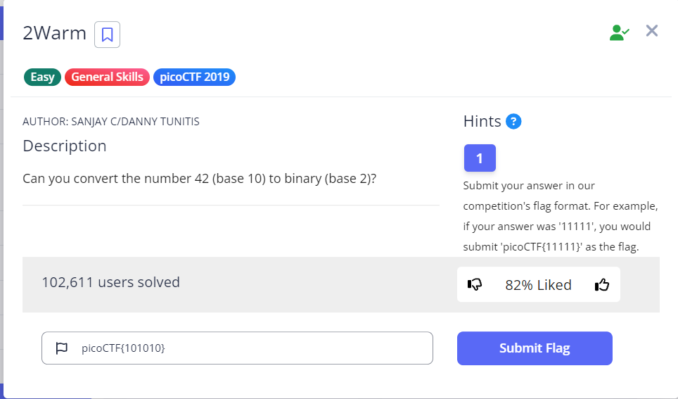

# 2Warm

- [Challenge information](#challenge-information)
- [Solution](#solution)
- [References](#references)
- [Flag](#flag)

## Challenge information
```
Tags: Easy, General Skills, picoCTF 2019
Author: SANJAY C/DANNY TUNITIS

Description:
Can you convert the number 42 (base 10) to binary (base 2)?

Hints:
1. Submit your answer in our competition's flag format. For example, if your answer was '11111', you would submit 'picoCTF{11111}' as the flag.
```

Challenge link: [https://play.picoctf.org/practice/challenge/86?category=5&page=3&search=](https://play.picoctf.org/practice/challenge/86?category=5&page=3&search=)

## Solution



## References

- [Convert decimal number 42 in base 2](https://coolconversion.com/math/binary-octal-hexa-decimal/Convert_decimal_number_42_in_base-2_)

## Flag

picoCTF{101010}