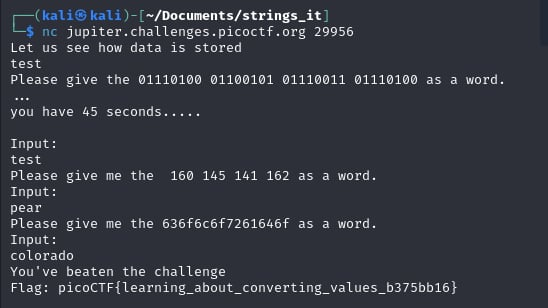

 # Based

- [Challenge information](#challenge-information)
- [Solution](#solution)
- [References](#references)
- [Flag](#flag)

## Challenge information
```
Tags: Easy, General Skills, picoCTF 2019
Author: SANJAY C/DANNY TUNITIS

Description:
Can you find the flag in file without running it?

Hints:
1. strings
```

Challenge link: [https://play.picoctf.org/practice/challenge/37?category=5&page=4&search=](https://play.picoctf.org/practice/challenge/37?category=5&page=4&search=)

## Solution



## References

- [Binary to Text Translator](https://www.rapidtables.com/convert/number/binary-to-ascii.html)
- [Hex To Text](https://www.duplichecker.com/hex-to-text.php)
- [Octal to Text Converter](https://onlinetexttools.com/convert-octal-to-text)

## Flag

picoCTF{learning_about_converting_values_b375bb16}