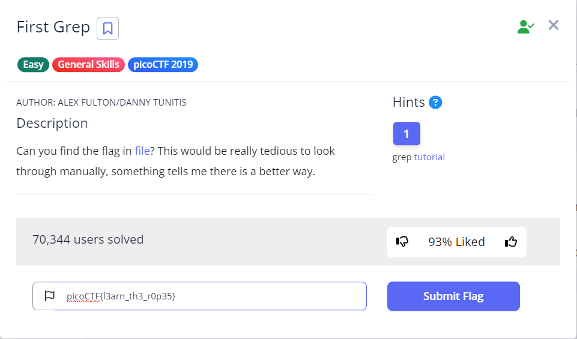

    # Bases

- [Challenge information](#challenge-information)
- [Solution](#solution)
- [References](#references)
- [Flag](#flag)

## Challenge information
```
Tags: Easy, General Skills, picoCTF 2019
Author: SANJAY C/DANNY TUNITIS

Description:
What does this bDNhcm5fdGgzX3IwcDM1 mean? I think it has something to do with bases.

Hints:
1. Submit your answer in our flag format. For example, if your answer was 'hello', you would submit 'picoCTF{hello}' as the flag.
```

Challenge link: [https://play.picoctf.org/practice/challenge/67?category=5&page=3&search=](https://play.picoctf.org/practice/challenge/67?category=5&page=3&search=)

## Solution

decode to base64




## References

- [BASE64 Decode and Encode](https://www.base64decode.org/)

## Flag

picoCTF{l3arn_th3_r0p35}