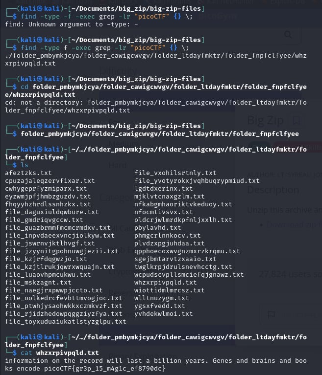

# Big Zip

- [Challenge information](#challenge-information)
- [Solution](#solution)
- [References](#references)
- [Flag](#flag)

## Challenge information
```
Tags: Easy, General Skills, picoGym Exclusive
Author: LT 'SYREAL' JONES

Description:
Unzip this archive and find the flag.
Download zip file

Hints:
1. Can grep be instructed to look at every file in a directory and its subdirectories?
```

Challenge link: [https://play.picoctf.org/practice/challenge/322?category=5&page=1&search=](https://play.picoctf.org/practice/challenge/322?category=5&page=1&search=)

## Solution

Unzip the file and type this command: ``find -type f -exec grep -lr "picoCTF" {} \;`` Then, change into that directory to find the flag.



## References

- [How to Find all Files Containing Specific Text (string) on Linux](https://www.geeksforgeeks.org/how-to-find-all-files-containing-specific-text-string-on-linux/)
- [How To Find a File In Linux From the Command Line](https://www.plesk.com/blog/various/find-files-in-linux-via-command-line/)

## Flag

picoCTF{gr3p_15_m4g1c_ef8790dc}