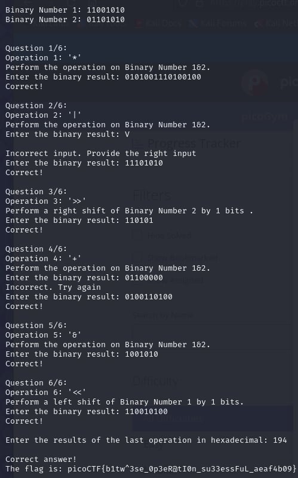

# binhexa

- [Challenge information](#challenge-information)
- [Solution](#solution)
- [References](#references)
- [Flag](#flag)

## Challenge information
```
Tags: Easy, General Skills, picoCTF2024, browser_webshell_solvable
Author: NANA AMA ATOMBO-SACKEY

Description:
How well can you perfom basic binary operations?
Start searching for the flag here nc titan.picoctf.net 49321
challenge.zip

Hints:
(None)
```

Challenge link: [https://play.picoctf.org/practice/challenge/404?category=5&page=1&search=](https://play.picoctf.org/practice/challenge/404?category=5&page=1&search=)

## Solution

Convert the given binary number by its operations to get the flag. You need to know how to solve ``binary operations``, including ``Bitwise AND, OR, XOR``, and ``bit shift``.



## References

- [Binary Operation](https://byjus.com/maths/binary-operation/)
- [Bitwise AND (&)](https://developer.mozilla.org/en-US/docs/Web/JavaScript/Reference/Operators/Bitwise_AND)
- [Binary Calculator](https://www.calculator.net/binary-calculator.html?number1=11001010&c2op=%2B&number2=01101010&calctype=op&x=Calculate)
- [Bitwise Calculator](https://miniwebtool.com/bitwise-calculator/)

## Flag

picoCTF{b1tw^3se_0p3eR@tI0n_su33essFuL_aeaf4b09}