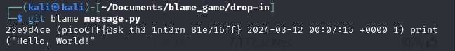

# Blame Game

- [Challenge information](#challenge-information)
- [Solution](#solution)
- [References](#references)
- [Flag](#flag)

## Challenge information
```
Tags: Easy, General Skills, picoCTF2024, browser_webshell_solvable, git
Author: JEFFERY JOHN

Description:
Someone's commits seems to be preventing the program from working. Who is it?
You can download the challenge files here:
challenge.zip

Hints:
1. In collaborative projects, many users can make many changes. How can you see the changes within one file?
2. Read the chapter on Git from the picoPrimer here.
3. You can use python3 <file>.py to try running the code, though you won't need to for this challenge.
```

Challenge link: [https://play.picoctf.org/practice/challenge/405?category=5&page=1&search=](https://play.picoctf.org/practice/challenge/405?category=5&page=1&search=)

## Solution

Type this command in Linux: ``git blame message.py`` to see who caused the error in the code.



## References

- [How to find the commit which introduced a bug](https://github.com/oppia/oppia/wiki/How-to-find-the-commit-which-introduced-a-bug)

## Flag

picoCTF{@sk_th3_1nt3rn_81e716ff}