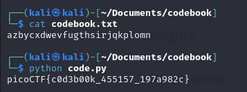

# Codebook

- [Challenge information](#challenge-information)
- [Solution](#solution)
- [Flag](#flag)

## Challenge information
```
Tags: Easy, General Skills, Beginner picoMini 2022, shell, Python
Author: LT 'SYREAL' JONES

Description:
Run the Python script code.py in the same directory as codebook.txt.
Download code.py
Download codebook.txt

Hints:
1. On the webshell, use ls to see if both files are in the directory you are in
2. The str_xor function does not need to be reverse engineered for this challenge.
```

Challenge link: [https://play.picoctf.org/practice/challenge/238?category=5&page=2&search=](https://play.picoctf.org/practice/challenge/238?category=5&page=2&search=)

## Solution

run the python script and get the flag



## Flag

picoCTF{c0d3b00k_455157_197a982c}