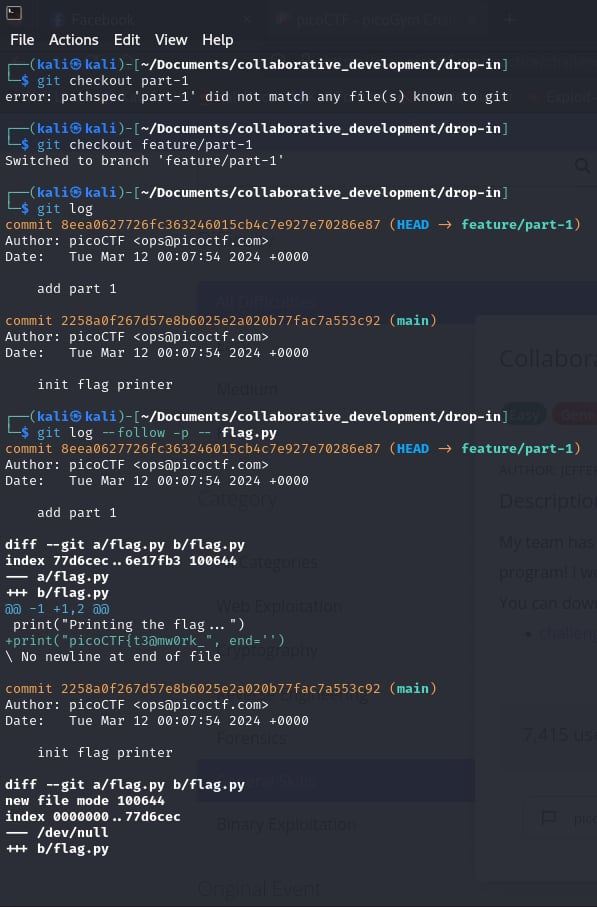

# Collaborative Development

- [Challenge information](#challenge-information)
- [Solution](#solution)
- [References](#references)
- [Flag](#flag)

## Challenge information
```
Tags: Easy, General Skills, picoCTF2024, browser_webshell_solvable, git
Author: JEFFERY JOHN

Description:
My team has been working very hard on new features for our flag printing program! I wonder how they'll work together?
You can download the challenge files here:
challenge.zip

Hints:
1. git branch -a will let you see available branches
2. How can file 'diffs' be brought to the main branch? Don't forget to git config!
3. Merge conflicts can be tricky! Try a text editor like nano, emacs, or vim.
```

Challenge link: [https://play.picoctf.org/practice/challenge/410?category=5&page=1&search=](https://play.picoctf.org/practice/challenge/410?category=5&page=1&search=)

## Solution

Checkout all branches using the command ``git branch -a`` and view the changes using the command ``git checkout feature/part-1`` Get the flag from each part one by one.



## References

- [Git checkout](https://www.atlassian.com/git/tutorials/using-branches/git-checkout?utm_source=gdn&utm_medium=paid-display&campaign=21252494340&adgroup=&device=c&devicemodel=&placement=&aceid=&creative=&adtype=&gclid=Cj0KCQjw-uK0BhC0ARIsANQtgGPVKyUlasCZ4XNFUE7wpdPkOxeA_5JKpWka_huVspPhbyUMCMhOHxIaAh7REALw_wcB&country=&network=x&targetid=&gad_source=1)

## Flag

picoCTF{t3@mw0rk_m@k3s_th3_dr3@m_w0rk_6c06cec1}