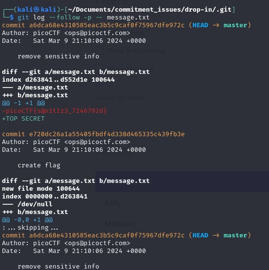

# endianness

- [Challenge information](#challenge-information)
- [Solution](#solution)
- [References](#references)
- [Flag](#flag)

## Challenge information
```
Tags: Easy, General Skills, picoCTF2024, browser_webshell_solvable, git
Author: JEFFERY JOHN

Description:
I accidentally wrote the flag down. Good thing I deleted it!
You download the challenge files here:
challenge.zip

Hints:
1. Version control can help you recover files if you change or lose them!
2. Read the chapter on Git from the picoPrimer here
3. You can 'checkout' commits to see the files inside them
```

Challenge link: [https://play.picoctf.org/practice/challenge/411?category=5&page=1&search=](https://play.picoctf.org/practice/challenge/411?category=5&page=1&search=)

## Solution

Just type ```git log --follow -p -- <file> in the Linux command line to see the change history of a file, and you will find the flag.



## References

- [See changes to a specific file using git](https://stackoverflow.com/questions/8048584/see-changes-to-a-specific-file-using-git)

## Flag

picoCTF{s@n1t1z3_7246792d}