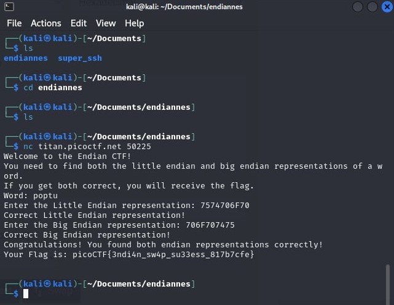

# endianness

- [Challenge information](#challenge-information)
- [Solution](#solution)
- [References](#references)
- [Flag](#flag)

## Challenge information
```
Tags: Easy, General Skills, picoCTF2024, browser_webshell_solvable
Author: JEFFERY JOHN

Description:
Know of little and big endian?
Source
nc titan.picoctf.net 50225

Hints:
1. You might want to check the ASCII table to first find the hexadecimal representation of characters before finding the endianness.
2. Read more about how endianness here
```

Challenge link: [https://play.picoctf.org/practice/challenge/414?category=5&page=1](https://play.picoctf.org/practice/challenge/414?category=5&page=1)

## Solution

just type the text to hex into the given word in little endian and big endian and you got the flag



## References

- [Understanding Big and Little Endian Byte Order](https://betterexplained.com/articles/understanding-big-and-little-endian-byte-order/)
- [ASCII Text to Hex Code Converter](https://www.rapidtables.com/convert/number/ascii-to-hex.html)

## Flag

picoCTF{3ndi4n_sw4p_su33ess_817b7cfe}