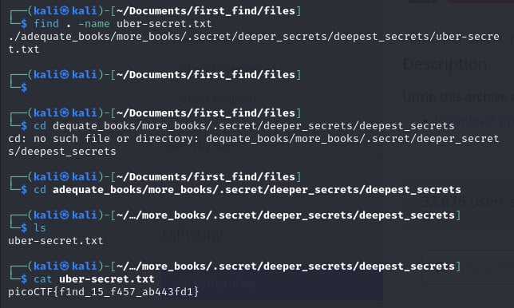

# First Find

- [Challenge information](#challenge-information)
- [Solution](#solution)
- [References](#references)
- [Flag](#flag)

## Challenge information
```
Tags: Easy, General Skills, picoGym Exclusive
Author:  LT 'SYREAL' JONES

Description:
Unzip this archive and find the file named 'uber-secret.txt'
Download zip file

Hints:
(None)
```

Challenge link: [https://play.picoctf.org/practice/challenge/320?category=5&page=2&search=](https://play.picoctf.org/practice/challenge/320?category=5&page=2&search=)

## Solution

Unzip the file and type this command: ``find . -name uber-secret.txt`` to search for the file in the current folder and every subdirectory to find the flag."



## References

- [How To Find a File In Linux From the Command Line](https://www.plesk.com/blog/various/find-files-in-linux-via-command-line/)

## Flag

picoCTF{f1nd_15_f457_ab443fd1}