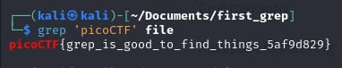

# 2Warm

- [Challenge information](#challenge-information)
- [Solution](#solution)
- [References](#references)
- [Flag](#flag)

## Challenge information
```
Tags: Easy, General Skills, picoCTF 2019
Author: SANJAY C/DANNY TUNITIS

Description:
Can you find the flag in file? This would be really tedious to look through manually, something tells me there is a better way.

Hints:
1. grep tutorial
```

Challenge link: [https://play.picoctf.org/practice/challenge/85?category=5&page=3&search=](https://play.picoctf.org/practice/challenge/85?category=5&page=3&search=)

## Solution



## References

- [grep command in Unix/Linux](https://www.geeksforgeeks.org/grep-command-in-unixlinux/)

## Flag

picoCTF{grep_is_good_to_find_things_5af9d829}