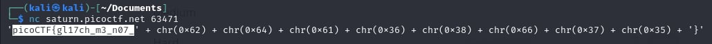
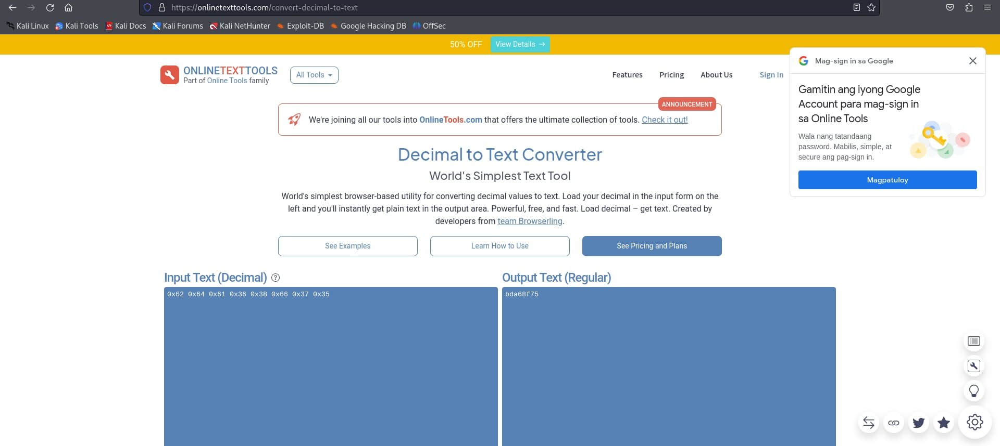

# Glitch Cat

- [Challenge information](#challenge-information)
- [Solution](#solution)
- [References](#references)
- [Flag](#flag)

## Challenge information
```
Tags: Easy, General Skills, picoGym Exclusive 2022, nc, shell, Python
Author:  LT 'SYREAL' JONES

Description:
Our flag printing service has started glitching!
Additional details will be available after launching your challenge instance.

Hints:
1. ASCII is one of the most common encodings used in programming
2. We know that the glitch output is valid Python, somehow!
3. Press Ctrl and c on your keyboard to close your connection and return to the command prompt.
```

Challenge link: [https://play.picoctf.org/practice/challenge/242?category=5&page=2&search=](https://play.picoctf.org/practice/challenge/242?category=5&page=2&search=)

## Solution

Use decimal to text converter




## References

- [Decimal to Text Converter](https://onlinetexttools.com/convert-decimal-to-text)

## Flag

picoCTF{gl17ch_m3_n07_bda68f75}