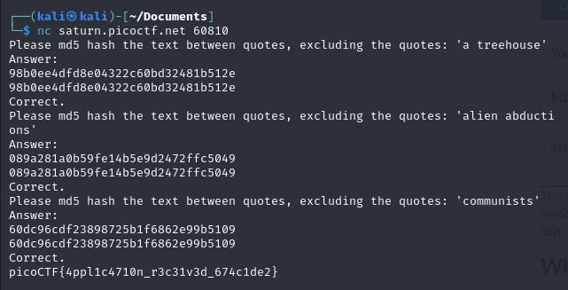

# HashingJobApp

- [Challenge information](#challenge-information)
- [Solution](#solution)
- [References](#references)
- [Flag](#flag)

## Challenge information
```
Tags: Easy, General Skills, picoGym Exclusive 2022, hashing, nc, shell, Python
Author:  LT 'SYREAL' JONES

Description:
If you want to hash with the best, beat this test!
nc saturn.picoctf.net 60810

Hints:
1. You can use a commandline tool or web app to hash text
2. Press Ctrl and c on your keyboard to close your connection and return to the command prompt.
```

Challenge link: [https://play.picoctf.org/practice/challenge/243?category=5&page=2&search=](https://play.picoctf.org/practice/challenge/243?category=5&page=2&search=)

## Solution

Hash the given text using an MD5 hash generator to get the flag.



## References

- [ MD5 Hash Generator](https://www.md5hashgenerator.com/)

## Flag

picoCTF{4ppl1c4710n_r3c31v3d_674c1de2}