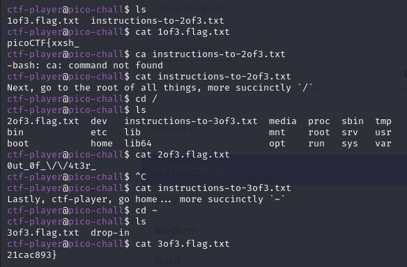

# Magikarp Ground Mission

- [Challenge information](#challenge-information)
- [Solution](#solution)
- [Flag](#flag)

## Challenge information
```
Tags: Easy, General Skills, picoCTF 2021
Author:  LT 'SYREAL' JONES

Description:
Do you know how to move between directories and read files in the shell? Start the container, `ssh` to it, and then `ls` once connected to begin. Login via `ssh` as `ctf-player` with the password, `abcba9f7`

Hints:
1. Finding a cheatsheet for bash would be really helpful!
```

Challenge link: [https://play.picoctf.org/practice/challenge/189?category=5&page=3&search=](https://play.picoctf.org/practice/challenge/189?category=5&page=3&search=)

## Solution



## Flag

picoCTF{xxsh_0ut_0f_\/\/4t3r_21cac893}