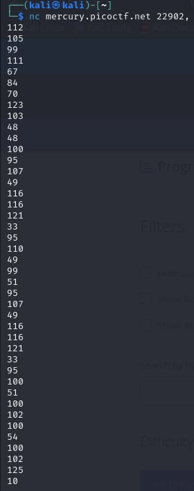
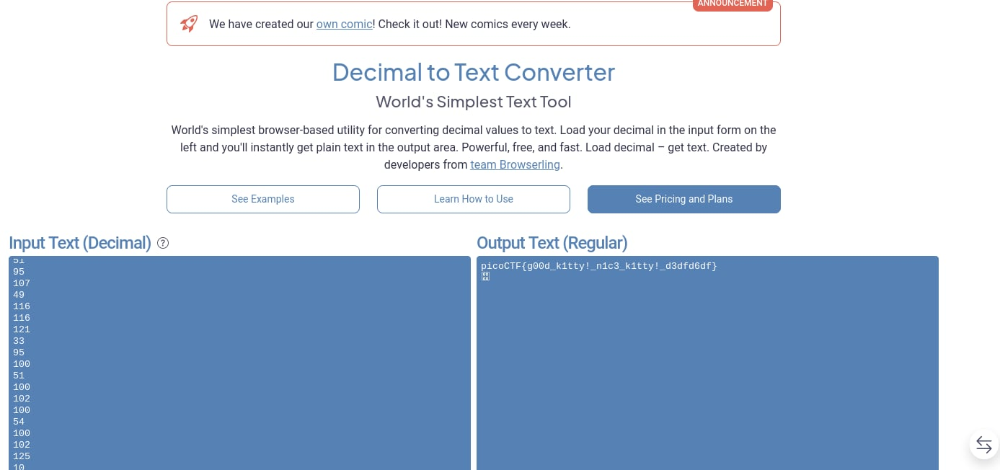

# Nice netcat...

- [Challenge information](#challenge-information)
- [Solution](#solution)
- [References](#references)
- [Flag](#flag)

## Challenge information
```
Tags: Easy, General Skills, picoCTF 2021
Author: SYREAL

Description:
There is a nice program that you can talk to by using this command in a shell: $ nc mercury.picoctf.net 22902, but it doesn't speak English...

Hints:
1. You can practice using netcat with this picoGym problem: what's a netcat?
2. You can practice reading and writing ASCII with this picoGym problem: Let's Warm Up
```

Challenge link: [https://play.picoctf.org/practice/challenge/156?category=5&page=3&search=](https://play.picoctf.org/practice/challenge/156?category=5&page=3&search=)

## Solution

convert the given decimal number into text





## References

- [Decimal to Text Converter](https://onlinetexttools.com/convert-decimal-to-text)

## Flag

picoCTF{g00d_k1tty!_n1c3_k1tty!_d3dfd6df}