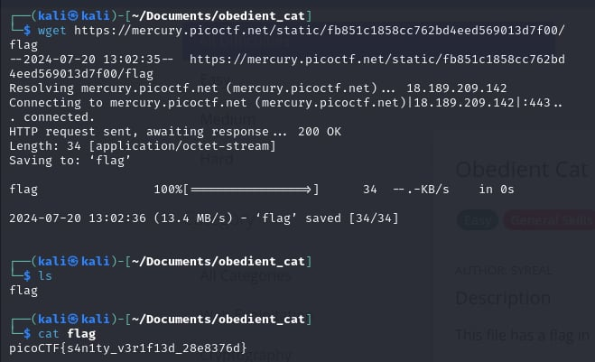

# Obedient Cat

- [Challenge information](#challenge-information)
- [Solution](#solution)
- [References](#references)
- [Flag](#flag)

## Challenge information
```
Tags: Easy, General Skills, picoCTF 2021
Author: SYREAL

Description:
This file has a flag in plain sight (aka "in-the-clear"). Download flag.

Hints:
1. Any hints about entering a command into the Terminal (such as the next one), will start with a '$'... everything after the dollar sign will be typed (or copy and pasted) into your Terminal.    
2. To get the file accessible in your shell, enter the following in the Terminal prompt: $ wget https://mercury.picoctf.net/static/fb851c1858cc762bd4eed569013d7f00/flag
3. $ man cat
```

Challenge link: [https://play.picoctf.org/practice/challenge/147?category=5&page=3&search=](https://play.picoctf.org/practice/challenge/147?category=5&page=3&search=)

## Solution

use ``cat``



## Flag

picoCTF{s4n1ty_v3r1f13d_28e8376d}