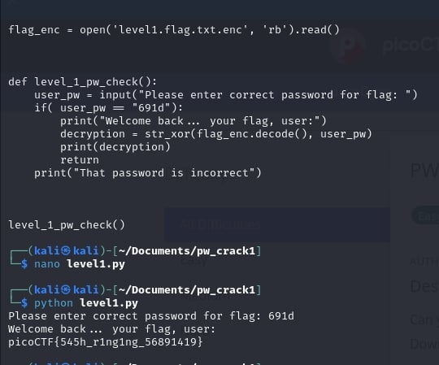

# PW Crack 1

- [Challenge information](#challenge-information)
- [Solution](#solution)
- [References](#references)
- [Flag](#flag)

## Challenge information
```
Tags: Easy, General Skills, Beginner picoMini 2022, password_cracking
Author: LT 'SYREAL' JONES

Description:
Can you crack the password to get the flag?
Download the password checker here and you'll need the encrypted flag in the same directory too.

Hints:
1. To view the file in the webshell, do: $ nano level1.py
2. To exit nano, press Ctrl and x and follow the on-screen prompts.
3. The str_xor function does not need to be reverse engineered for this challenge.
```

Challenge link: [https://play.picoctf.org/practice/challenge/245?category=5&page=2&search=](https://play.picoctf.org/practice/challenge/245?category=5&page=2&search=)

## Solution

View the Python script, find the decimal values, and convert them into text to get the flag.



## Flag

picoCTF{545h_r1ng1ng_56891419}