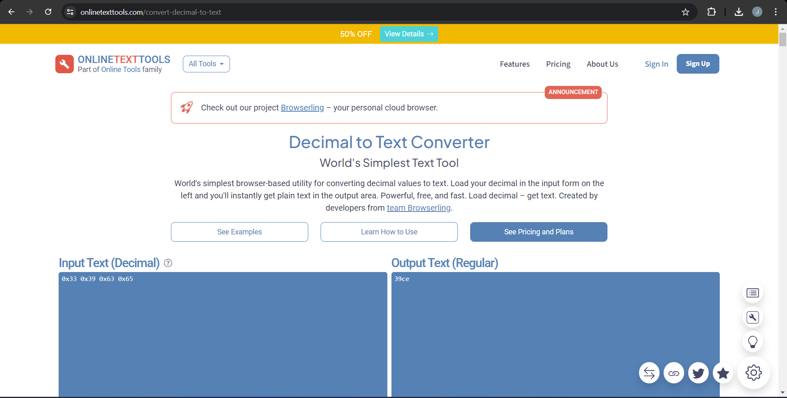
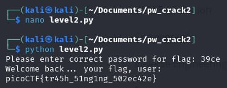

# PW Crack 2

- [Challenge information](#challenge-information)
- [Solution](#solution)
- [References](#references)
- [Flag](#flag)

## Challenge information
```
Tags: Easy, General Skills, Beginner picoMini 2022, password_cracking, hashing
Author: LT 'SYREAL' JONES

Description:
Can you crack the password to get the flag?
Download the password checker here and you'll need the encrypted flag in the same directory too.

Hints:
1. Does that encoding look familiar?
2. The str_xor function does not need to be reverse engineered for this challenge.
```

Challenge link: [https://play.picoctf.org/practice/challenge/246?category=5&page=2&search=](https://play.picoctf.org/practice/challenge/246?category=5&page=2&search=)

## Solution

View the Python script, find the decimal values, and convert them into text to get the flag.




## References

- [Decimal to Text Converter](https://onlinetexttools.com/convert-decimal-to-text)

## Flag

picoCTF{tr45h_51ng1ng_502ec42e}