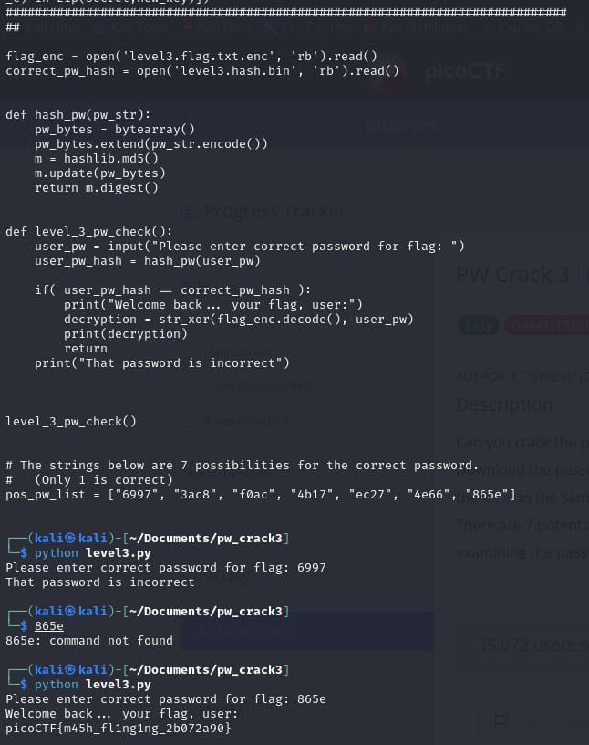

# PW Crack 3

- [Challenge information](#challenge-information)
- [Solution](#solution)
- [Flag](#flag)

## Challenge information
```
Tags: Easy, General Skills, Beginner picoMini 2022, password_cracking, hashing
Author: LT 'SYREAL' JONES

Description:
Can you crack the password to get the flag?
Download the password checker here and you'll need the encrypted flag and the hash in the same directory too.
There are 7 potential passwords with 1 being correct. You can find these by examining the password checker script

Hints:
1. To view the level3.hash.bin file in the webshell, do: $ bvi level3.hash.bin
2. To exit bvi type :q and press enter.
3. The str_xor function does not need to be reverse engineered for this challenge.
```

Challenge link: [https://play.picoctf.org/practice/challenge/247?category=5&page=2&search=](https://play.picoctf.org/practice/challenge/247?category=5&page=2&search=)

## Solution

Run the Python script, and at the end, you will see the password list. Input 7 passwords one by one until you get the correct one and find the flag.



## Flag

picoCTF{m45h_fl1ng1ng_2b072a90}