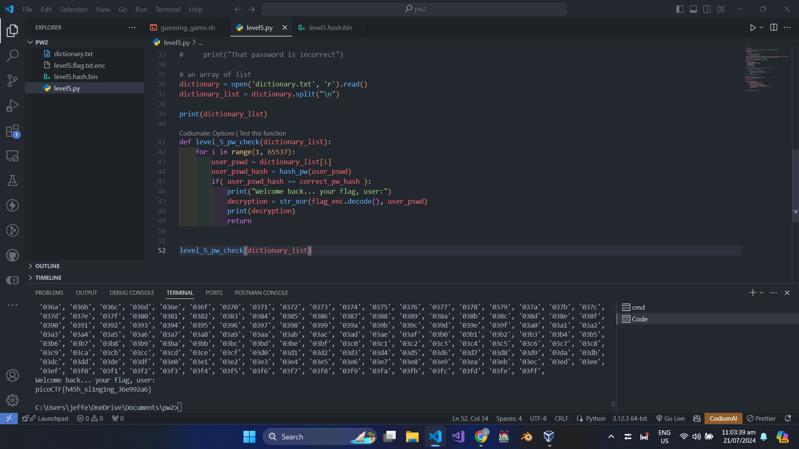

# PW Crack 5

- [Challenge information](#challenge-information)
- [Solution](#solution)
- [References](#references)
- [Flag](#flag)

## Challenge information
```
Tags: Medium, General Skills, Beginner picoMini 2022, password_cracking, hashing
Author: LT 'SYREAL' JONES

Description:
Can you crack the password to get the flag?
Download the password checker here and you'll need the encrypted flag and the hash in the same directory too. Here's a dictionary with all possible passwords based on the password conventions we've seen so far.

Hints:
1. Opening a file in Python is crucial to using the provided dictionary.
2. You may need to trim the whitespace from the dictionary word before hashing. Look up the Python string function, strip
3. The str_xor function does not need to be reverse engineered for this challenge.
```

Challenge link: [https://play.picoctf.org/practice/challenge/249?category=5&page=4&search=](https://play.picoctf.org/practice/challenge/249?category=5&page=4&search=)

## Solution

I used brute force for this challenge. First, I converted dictionary.txt into a list, then used a for loop to check each possible answer in the level5_pw_check.



## References

- [Python String strip() Method](https://www.w3schools.com/python/ref_string_strip.asp)
- [Python open() Function](https://www.w3schools.com/python/ref_func_open.asp)
- [Python String split() Method](https://www.w3schools.com/python/ref_string_split.asp)
- [Python range() Function](https://www.w3schools.com/python/ref_func_range.asp)

## Flag

picoCTF{h45h_sl1ng1ng_36e992a6}