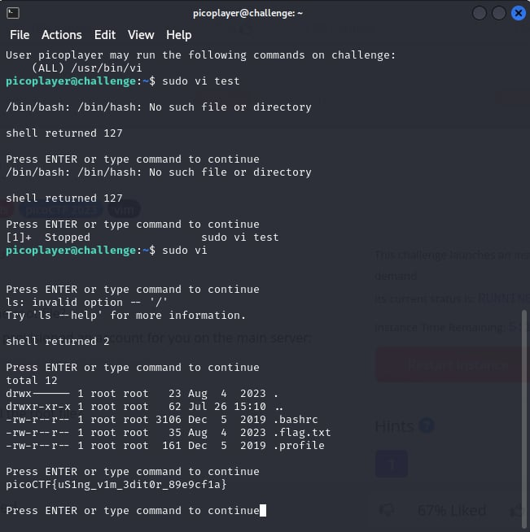

# Special

- [Challenge information](#challenge-information)
- [Solution](#solution)
- [Flag](#flag)

## Challenge information

Tags: Medium, General Skills, picoCTF2023, vim
Author: GEOFFREY NJOGU

Description:
Can you read files in the root file?
The system admin has provisioned an account for you on the main server:
ssh -p 53795 picoplayer@saturn.picoctf.net
Password: UYiOazkqY2
Can you login and read the root file?

Hints:
1.What permissions do you have?

Challenge link: [https://play.picoctf.org/practice/challenge/363?category=5&page=4&search=](https://play.picoctf.org/practice/challenge/363?category=5&page=4&search=)

## Solution

Use ``sudo vi`` to access superuser mode and then use the following commands: ``:! ls -al /root`` to see the hidden files in the root directory and ``:! cat /root/.flag.txt`` to see the flag."

## Flag

picoCTF{uS1ng_v1m_3dit0r_89e9cf1a}