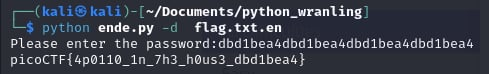

# Python Wrangling

- [Challenge information](#challenge-information)
- [Solution](#solution)
- [Flag](#flag)

## Challenge information
```
Tags: Easy, General Skills, picoCTF 2021
Author: SYREAL

Description:
Python scripts are invoked kind of like programs in the Terminal... Can you run this Python script using this password to get the flag?

Hints:
1. Get the Python script accessible in your shell by entering the following command in the Terminal prompt: $ wget https://mercury.picoctf.net/static/1b247b1631eb377d9392bfa4871b2eb1/ende.py
2. $ man python
```

Challenge link: [https://play.picoctf.org/practice/challenge/166?category=5&page=3&search=](https://play.picoctf.org/practice/challenge/166?category=5&page=3&search=)

## Solution

use this command ``python ende.py -d flag.txt.en`` and get the flag



## Flag

picoCTF{4p0110_1n_7h3_h0us3_dbd1bea4}