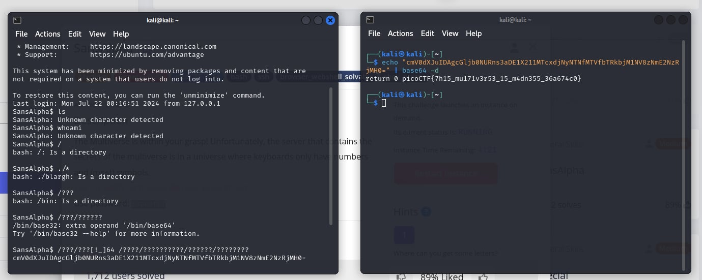

# SansAlpha

- [Challenge information](#challenge-information)
- [Solution](#solution)
- [References](#references)
- [Flag](#flag)

## Challenge information
```
Tags: Medium, General Skills, picoCTF2024, bash, ssh, browser_webshell_solvable, shell_escape
Author: SYREAL

Description:
The Multiverse is within your grasp! Unfortunately, the server that contains the secrets of the multiverse is in a universe where keyboards only have numbers and (most) symbols.
Additional details will be available after launching your challenge instance.

Hints:
1. Where can you get some letters?
```

Challenge link: [https://play.picoctf.org/practice/challenge/436?category=5&page=4&search=](https://play.picoctf.org/practice/challenge/436?category=5&page=4&search=)

## Solution

It uses wildcards and can't input letters, so I went to bin/base64 to encode the flag and decode it. The command is ``/???/???[!_]64 /????/??????????/??????/????????``.



## References

- [Wildcards](https://tldp.org/LDP/GNU-Linux-Tools-Summary/html/x11655.htm)
- [Globbing](https://tldp.org/LDP/abs/html/globbingref.html)

## Flag

picoCTF{7h15_mu171v3r53_15_m4dn355_36a674c0}