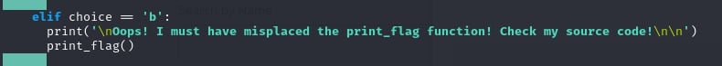
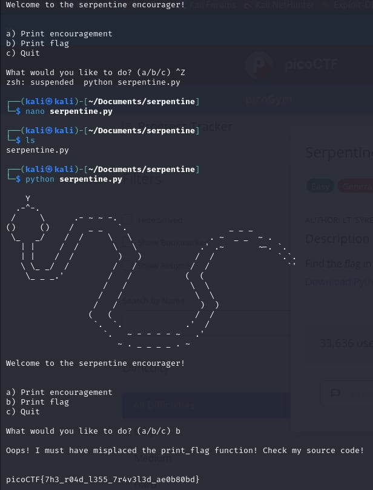

# Serpentine    

- [Challenge information](#challenge-information)
- [Solution](#solution)
- [References](#references)
- [Flag](#flag)

## Challenge information
```
Tags: Easy, General Skills, Beginner picoMini 2022, Python
Author:  LT 'SYREAL' JONES

Description:
Find the flag in the Python script!
Download Python script

Hints:
1. Try running the script and see what happens
2. In the webshell, try examining the script with a text editor like nano
3. To exit nano, press Ctrl and x and follow the on-screen prompts.
3. The str_xor function does not need to be reverse engineered for this challenge.
```

Challenge link: [https://play.picoctf.org/practice/challenge/251?category=5&page=2&search=](https://play.picoctf.org/practice/challenge/251?category=5&page=2&search=)

## Solution

Edit the file using the command ``nano serpentine.py`` and call the print_flag() function in choice 'b'.




## References

- [How to edit a text file in my terminal](https://stackoverflow.com/questions/35695160/how-to-edit-a-text-file-in-my-terminal)

## Flag

picoCTF{7h3_r04d_l355_7r4v3l3d_ae0b80bd}