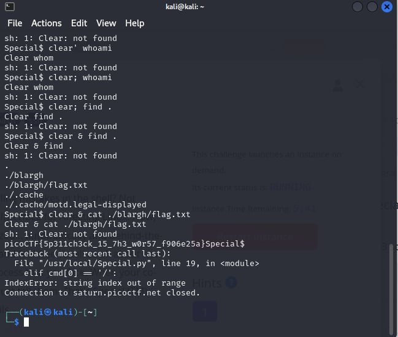

# Special

- [Challenge information](#challenge-information)
- [Solution](#solution)
- [Flag](#flag)

## Challenge information
```
Tags: Medium, General Skills, picoCTF2023, bash, ssh
Author:  LT 'SYREAL' JONES, ET AL.

Description:
Don't power users get tired of making spelling mistakes in the shell? Not anymore! Enter Special, the Spell Checked Interface for Affecting Linux. Now, every word is properly spelled and capitalized... automatically and behind-the-scenes! Be the first to test Special in beta, and feel free to tell us all about how Special streamlines every development process that you face. When your co-workers see your amazing shell interface, just tell them: That's Special (TM)
Start your instance to see connection details.
ssh -p 58633 ctf-player@saturn.picoctf.net
The password is 3f39b042

Hints:
1. Experiment with different shell syntax
```

Challenge link: [https://play.picoctf.org/practice/challenge/377?category=5&page=4&search=](https://play.picoctf.org/practice/challenge/377?category=5&page=4&search=)

## Solution

I used the command ``clear & find .`` to view the files and locate the flag. Then, I navigated to the directory and used ``clear & cat ./blargh/flag.txt`` to read the flag.



## Flag

picoCTF{5p311ch3ck_15_7h3_w0r57_f906e25a}