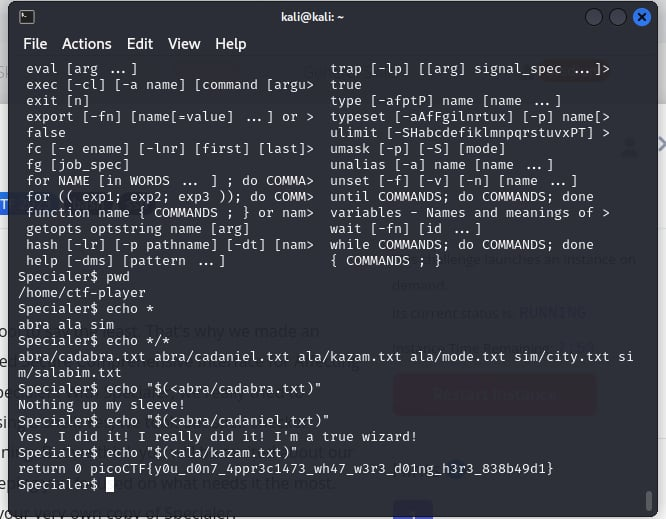

# Specialer

- [Challenge information](#challenge-information)
- [Solution](#solution)
- [References](#references)
- [Flag](#flag)

## Challenge information
```
Tags: Medium, General Skills, picoCTF2023, bash, ssh
Author:  LT 'SYREAL' JONES, ET AL.

Description:
Reception of Special has been cool to say the least. That's why we made an exclusive version of Special, called Secure Comprehensive Interface for Affecting Linux Empirically Rad, or just 'Specialer'. With Specialer, we really tried to remove the distractions from using a shell. Yes, we took out spell checker because of everybody's complaining. But we think you will be excited about our new, reduced feature set for keeping you focused on what needs it the most. Please start an instance to test your very own copy of Specialer.
Additional details will be available after launching your challenge instance.

Hints:
1. What programs do you have access to?
```

Challenge link: [https://play.picoctf.org/practice/challenge/378?category=5&page=4&search=](https://play.picoctf.org/practice/challenge/378?category=5&page=4&search=)

## Solution

It has limited commands and cannot use ls or other commands, but ``echo`` works. I used ``echo *`` to view all directories and ``echo "$(<filename)"`` to print the file.



## References

- [How can I display the contents of a text file on the command line?](https://unix.stackexchange.com/questions/86321/how-can-i-display-the-contents-of-a-text-file-on-the-command-line)

## Flag

picoCTF{y0u_d0n7_4ppr3c1473_wh47_w3r3_d01ng_h3r3_838b49d1}