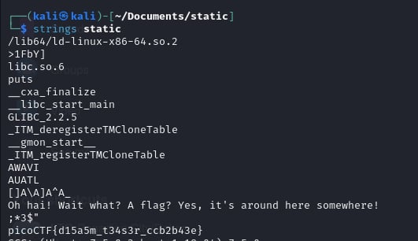

# Python Wrangling

- [Challenge information](#challenge-information)
- [Solution](#solution)
- [References](#references)
- [Flag](#flag)

## Challenge information
```
Tags: Easy, General Skills, picoCTF 2021
Author: SYREAL

Description:
Can you look at the data in this binary: static? This BASH script might help!

Hints:
(None)
```

Challenge link: [https://play.picoctf.org/practice/challenge/163?category=5&page=3&search=](https://play.picoctf.org/practice/challenge/163?category=5&page=3&search=)

## Solution

use `strings` for binary file



## References

- [‘strings’ Linux Command | Extracting Strings in Binary Files](https://ioflood.com/blog/strings-linux-command/#:~:text=The%20'strings'%20command%20in%20Linux%20is%20used%20to%20extract%20readable,bin%20.&text=In%20this%20example%2C%20we've,a%20binary%20file%20named%20'myfile.)

## Flag

picoCTF{d15a5m_t34s3r_ccb2b43e}