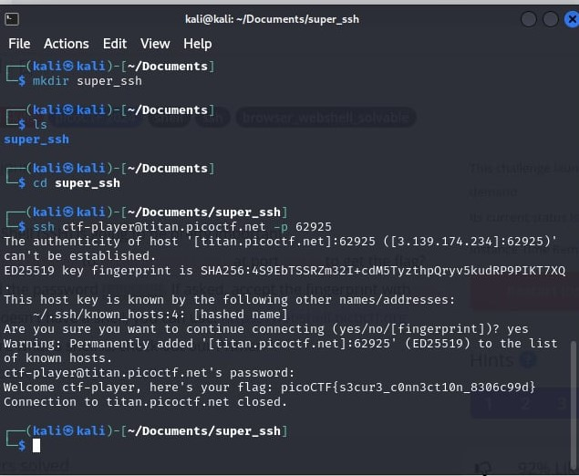

# Super SSH

- [Challenge information](#challenge-information)
- [Solution](#solution)
- [References](#references)
- [Flag](#flag)

## Challenge information
```
Tags: Easy, General Skills, picoCTF2024, shell, ssh, browser_webshell_solvable
Author: JEFFERY JOHN

Description:
Using a Secure Shell (SSH) is going to be pretty important.
Can you ssh as ctf-player to titan.picoctf.net at port 55790 to get the flag?
You'll also need the password 1ad5be0d. If asked, accept the fingerprint with yes.
If your device doesn't have a shell, you can use: https://webshell.picoctf.org
If you're not sure what a shell is, check out our Primer: https://primer.picoctf.com/#_the_shell

Hints:
1. https://linux.die.net/man/1/ssh
2. You can try logging in 'as' someone with <user>@titan.picoctf.net
3. How could you specify the port?
4. Remember, passwords are hidden when typed into the shell
```

Challenge link: [https://play.picoctf.org/practice/challenge/424?category=5&page=1](https://play.picoctf.org/practice/challenge/424?category=5&page=1)

## Solution

Just type this command in Linux: ssh ctf-player@titan.picoctf.net -p 62925, type 'yes' when prompted, enter the given password, and you will find the flag.



## References

- [How to use SSH](https://www.geeksforgeeks.org/ssh-command-in-linux-with-examples/)

## Flag

picoCTF{s3cur3_c0nn3ct10n_8306c99d}