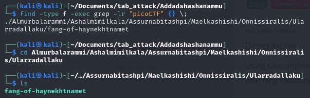
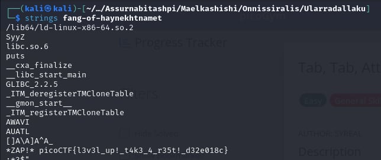

# Tab, Tab, Attack

- [Challenge information](#challenge-information)
- [Solution](#solution)
- [References](#references)
- [Flag](#flag)

## Challenge information
```
Tags: Easy, General Skills, picoCTF 2021
Author: SYREAL

Description:
Using tabcomplete in the Terminal will add years to your life, esp. when dealing with long rambling directory structures and filenames: Addadshashanammu.zip

Hints:
1. After `unzip`ing, this problem can be solved with 11 button-presses...(mostly Tab)...
```

Challenge link: [https://play.picoctf.org/practice/challenge/176?category=5&page=3&search=](https://play.picoctf.org/practice/challenge/176?category=5&page=3&search=)

## Solution

Type this command in Linux: ``find -type f -exec grep -lr "picoCTF" {} \;`` cd to the file



and use ``strings`` for binary file



## References

- [How to Find all Files Containing Specific Text (string) on Linux](https://www.geeksforgeeks.org/how-to-find-all-files-containing-specific-text-string-on-linux/)
- [‘strings’ Linux Command | Extracting Strings in Binary Files](https://ioflood.com/blog/strings-linux-command/#:~:text=The%20'strings'%20command%20in%20Linux%20is%20used%20to%20extract%20readable,bin%20.&text=In%20this%20example%2C%20we've,a%20binary%20file%20named%20'myfile.)


## Flag

picoCTF{l3v3l_up!_t4k3_4_r35t!_d32e018c}