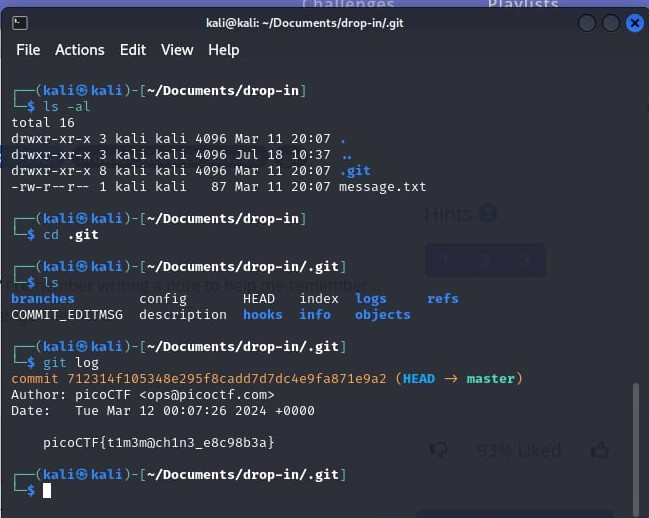

# Time Machine

- [Challenge information](#challenge-information)
- [Solution](#solution)
- [References](#references)
- [Flag](#flag)

## Challenge information
```
Tags: Easy, General Skills, picoCTF2024, browser_webshell_solvable, git
Author: JEFFERY JOHN

Description:
What was I last working on? I remember writing a note to help me remember...
You can download the challenge files here: [challenges.zip](https://play.picoctf.org/practice/challenge/425?category=5&difficulty=1&page=1)

Hints:
1. The cat command will let you read a file, but that won't help you here!
2. Read the chapter on Git from the picoPrimer here.
3. When committing a file with git, a message can (and should) be included.
```

Challenge link: [https://play.picoctf.org/practice/challenge/425?category=5&difficulty=1&page=1](https://play.picoctf.org/practice/challenge/425?category=5&difficulty=1&page=1)

## Solution

First, I downloaded the challenges zip file and opened the .git folder using ls -al to view hidden files. Then, I typed git log to view the commit messages.



## References

- [Git Commit History](https://www.warp.dev/terminus/git-commit-history)

## Flag

picoCTF{t1m3m@ch1n3_e8c98b3a}