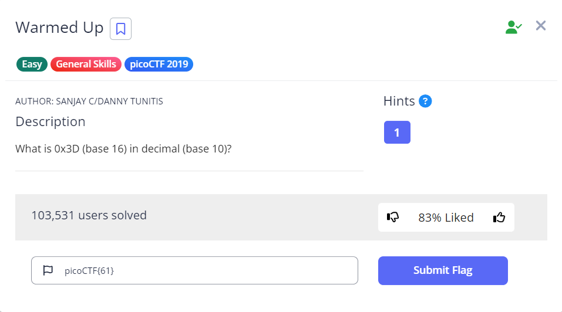

 # Warmed Up

- [Challenge information](#challenge-information)
- [Solution](#solution)
- [References](#references)
- [Flag](#flag)

## Challenge information
```
Tags: Easy, General Skills, picoCTF 2019
Author: SANJAY C/DANNY TUNITIS

Description:
What is 0x3D (base 16) in decimal (base 10)?

Hints:
1. Submit your answer in our flag format. For example, if your answer was '22', you would submit 'picoCTF{22}' as the flag.
```

Challenge link: [https://play.picoctf.org/practice/challenge/58?category=5&page=3&search=](https://play.picoctf.org/practice/challenge/58?category=5&page=3&search=)

## Solution



## References

- [Hexadecimal to Decimal converter](https://www.rapidtables.com/convert/number/hex-to-decimal.html?x=3D)

## Flag

picoCTF{61}