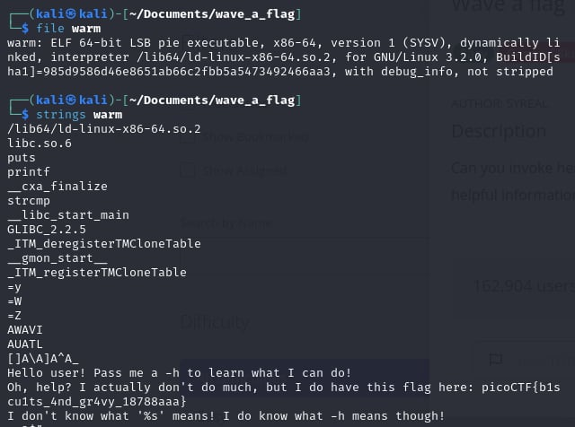

# Wave a flag

- [Challenge information](#challenge-information)
- [Solution](#solution)
- [References](#references)
- [Flag](#flag)

## Challenge information
```
Tags: Easy, General Skills, picoCTF 2021
Author: SYREAL

Description:
Can you invoke help flags for a tool or binary? This program has extraordinarily helpful information...

Hints:
1. This program will only work in the webshell or another Linux computer.
2. To get the file accessible in your shell, enter the following in the Terminal prompt: $ wget https://mercury.picoctf.net/static/a00f554b16385d9970dae424f66ee1ab/warm    
3. Run this program by entering the following in the Terminal prompt: $ ./warm, but you'll first have to make it executable with $ chmod +x warm
4. -h and --help are the most common arguments to give to programs to get more information from them!
5. Not every program implements help features like -h and --help.
```

Challenge link: [https://play.picoctf.org/practice/challenge/170?category=5&page=3&search=](https://play.picoctf.org/practice/challenge/170?category=5&page=3&search=)

## Solution

use ``strings`` for a binary file



## References

- [‘strings’ Linux Command | Extracting Strings in Binary Files](https://ioflood.com/blog/strings-linux-command/#:~:text=The%20'strings'%20command%20in%20Linux%20is%20used%20to%20extract%20readable,bin%20.&text=In%20this%20example%2C%20we've,a%20binary%20file%20named%20'myfile.)

## Flag

picoCTF{b1scu1ts_4nd_gr4vy_18788aaa}