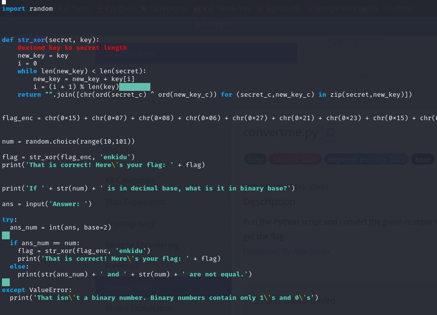

# convertme.py

- [Challenge information](#challenge-information)
- [Solution](#solution)
- [Flag](#flag)

## Challenge information
```
Tags: Easy, General Skills, Beginner picoMini 2022, base, Python
Author:  LT 'SYREAL' JONES

Description:
Run the Python script and convert the given number from decimal to binary to get the flag.
Download Python script

Hints:
1. Look up a decimal to binary number conversion app on the web or use your computer's calculator!
2. The str_xor function does not need to be reverse engineered for this challenge.
3. If you have Python on your computer, you can download the script normally and run it. Otherwise, use the wget command in the webshell.
4. To use wget in the webshell, first right click on the download link and select 'Copy Link' or 'Copy Link Address'
5. Type everything after the dollar sign in the webshell: $ wget , then paste the link after the space after wget and press enter. This will download the script for you in the webshell so you can run it!
6. Finally, to run the script, type everything after the dollar sign and then press enter: $ python3 convertme.py
```

Challenge link: [https://play.picoctf.org/practice/challenge/239?category=5&page=2&search=](https://play.picoctf.org/practice/challenge/239?category=5&page=2&search=)

## Solution

Edit the Python script to print the flag directly before the question, like this.



and get the flag


## Flag

picoCTF{4ll_y0ur_b4535_762f748e}