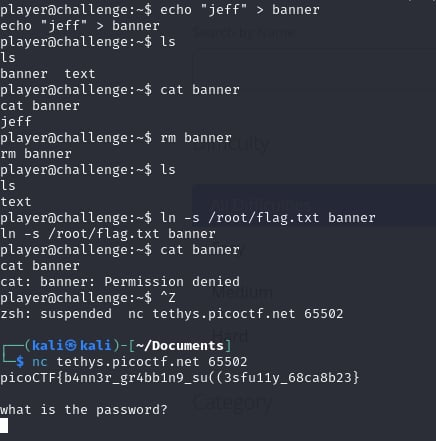

# dont-you-love-banners

- [Challenge information](#challenge-information)
- [Solution](#solution)
- [References](#references)
- [Flag](#flag)

## Challenge information
```
Tags: Medium, General Skills, picoCTF2024, shell, browser_webshell_solvable
Author: LOIC SHEMA / SYREAL

Description:
Can you abuse the banner?
The server has been leaking some crucial information on tethys.picoctf.net 64111. Use the leaked information to get to the server.
To connect to the running application use nc tethys.picoctf.net 65502. From the above information abuse the machine and find the flag in the /root directory.

Hints:
1. Do you know about symlinks?
2. Maybe some small password cracking or guessing
```

Challenge link: [https://play.picoctf.org/practice/challenge/437?category=5&page=4&search=](https://play.picoctf.org/practice/challenge/437?category=5&page=4&search=)

## Solution

When the program starts, it runs the banner file and the text file says 'keep digging,' hinting the flag is in the root directory. Create a symlink from banner to flag.txt to print the flag when the program starts. Use this command: ``ln -s /root/flag.txt banner``.



## References

- [Linux ln – How to Create a Symbolic Link in Linux [Example Bash Command]](https://www.freecodecamp.org/news/linux-ln-how-to-create-a-symbolic-link-in-linux-example-bash-command/)

## Flag

picoCTF{b4nn3r_gr4bb1n9_su((3sfu11y_68ca8b23}