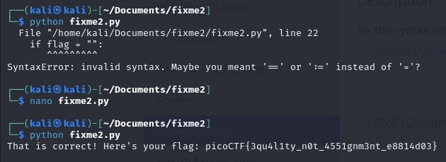

# fixme.py

- [Challenge information](#challenge-information)
- [Solution](#solution)
- [Flag](#flag)

## Challenge information
```
Tags: Easy, General Skills, Beginner picoMini 2022, Python
Author:  LT 'SYREAL' JONES

Description:
Fix the syntax error in the Python script to print the flag.
Download Python script

Hints:
1. Are equality and assignment the same symbol?
2. To view the file in the webshell, do: $ nano fixme2.py
3. To exit nano, press Ctrl and x and follow the on-screen prompts.
4. The str_xor function does not need to be reverse engineered for this challenge.
```

Challenge link: [https://play.picoctf.org/practice/challenge/241?category=5&page=2&search=](https://play.picoctf.org/practice/challenge/241?category=5&page=2&search=)

## Solution

fix the code and get the flag



## Flag

picoCTF{3qu4l1ty_n0t_4551gnm3nt_e8814d03}a