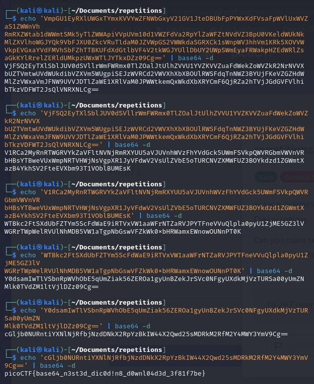

# repetitions

- [Challenge information](#challenge-information)
- [Solution](#solution)
- [References](#references)
- [Flag](#flag)

## Challenge information
```
Tags: Easy, General Skills, picoCTF2023, base64
Author: THEONESTE BYAGUTANGAZA

Description:
Can you make sense of this file?
Download the file here.

Hints:
1. Multiple decoding is always good.
```

Challenge link: [https://play.picoctf.org/practice/challenge/371?category=5&page=1&search=](https://play.picoctf.org/practice/challenge/371?category=5&page=1&search=)

## Solution

Just perform base64 decoding, and then convert the result into base64 again, repeating this process until you find the flag.



## References

- [base64 Linux Command Guide: Encode and Decode Data](https://ioflood.com/blog/base64-linux-command/#:~:text=To%20encode%20data%20in%20Linux,making%20it%20safe%20for%20transmission.&text=In%20this%20example%2C%20we're,string%20to%20the%20base64%20command.)

## Flag

picoCTF{base64_n3st3d_dic0d!n8_d0wnl04d3d_3f81f7be}