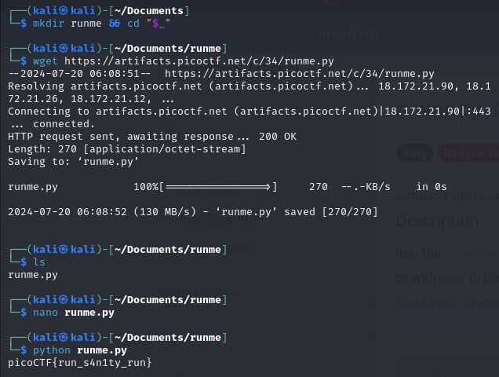

# runme.py    

- [Challenge information](#challenge-information)
- [Solution](#solution)
- [References](#references)
- [Flag](#flag)

## Challenge information
```
Tags: Easy, General Skills, Beginner picoMini 2022, Python
Author:  LT 'SYREAL' JONES

Description:
Run the runme.py script to get the flag. Download the script with your browser or with wget in the webshell.
Download runme.py Python script

Hints:
1. If you have Python on your computer, you can download the script normally and run it. Otherwise, use the wget command in the webshell.
2. To use wget in the webshell, first right click on the download link and select 'Copy Link' or 'Copy Link Address'
3. Type everything after the dollar sign in the webshell: $ wget , then paste the link after the space after wget and press enter. This will download the script for you in the webshell so you can run it!
3. Finally, to run the script, type everything after the dollar sign and then press enter: $ python3 runme.py You should have the flag now!
```

Challenge link: [https://play.picoctf.org/practice/challenge/250?category=5&page=2&search=](https://play.picoctf.org/practice/challenge/250?category=5&page=2&search=)

## Solution

Run the Python script using this command: ``python runme.py`` to get the flag.



## References

- [How to run a Python script on Linux?](https://stackoverflow.com/questions/71427901/how-to-run-a-python-script-on-linux)

## Flag

picoCTF{run_s4n1ty_run}