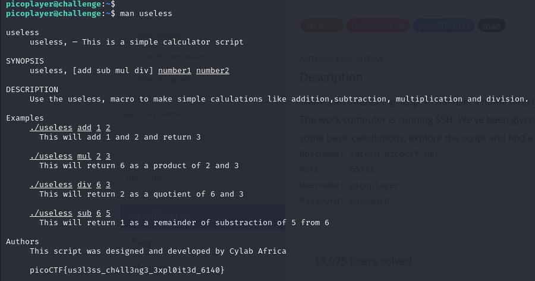

# useless

- [Challenge information](#challenge-information)
- [Solution](#solution)
- [Flag](#flag)

## Challenge information
    ```
Tags: Medium, General Skills, picoCTF2023, bash, man
Author: LOIC SHEMA

Description:
There's an interesting script in the user's home directory
Additional details will be available after launching your challenge instance.

```

Challenge link: [https://play.picoctf.org/practice/challenge/384?category=5&page=4&search=](https://play.picoctf.org/practice/challenge/384?category=5&page=4&search=)

## Solution

It's literally a useless challenge. Just type ``man useless`` and hit enter to get the flag.



## Flag

picoCTF{us3l3ss_ch4ll3ng3_3xpl0it3d_6140}