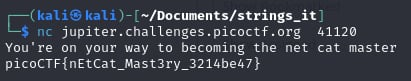

 # what's a net cat?

- [Challenge information](#challenge-information)
- [Solution](#solution)
- [Flag](#flag)

## Challenge information
```
Tags: Easy, General Skills, picoCTF 2019
Author: SANJAY C/DANNY TUNITIS

Description:
Using netcat (nc) is going to be pretty important. Can you connect to jupiter.challenges.picoctf.org at port 41120 to get the flag?

Hints:
1. nc tutorial
```

Challenge link: [https://play.picoctf.org/practice/challenge/34?category=5&page=4&search=](https://play.picoctf.org/practice/challenge/34?category=5&page=4&search=)

## Solution



## Flag

picoCTF{nEtCat_Mast3ry_3214be47}