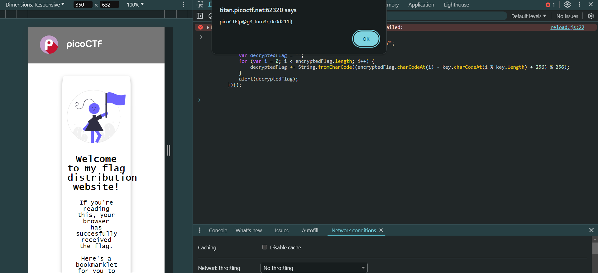

# BookMarklet

## Solution

Run the JavaScript code in the browser

Or paste the js code in url bookmark

## References

- [Create, find and edit bookmarks in Chrome](https://support.google.com/chrome/answer/188842?hl=en&co=GENIE.Platform%3DDesktop)