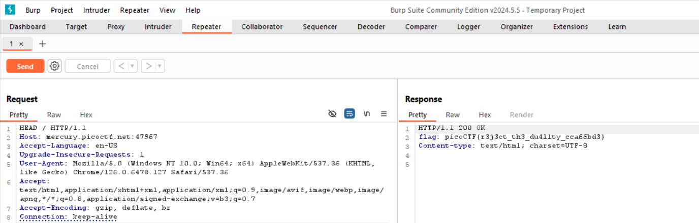

# GET aHEAD

## Solution

modify the request and change http request to HEAD

## References

- [HEAD](https://http.dev/head#:~:text=The%20HTTP%20HEAD%20method%20is,following%20the%20HTTP%20header%20section.)