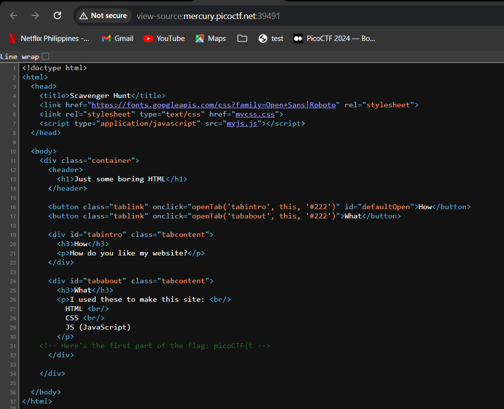
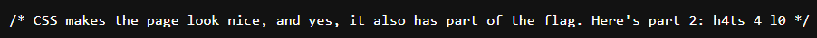
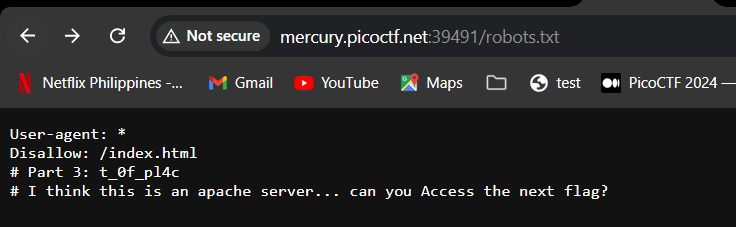
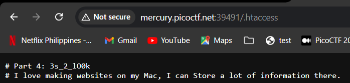
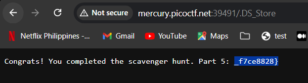

# Scavenger Hunt

## Solution

page source of the website

css file

robots.txt

.htaccess

.ds_store

## References

- [Apache Configuration Files](https://httpd.apache.org/docs/2.4/configuring.html)
- [What Is .DS_Store Files | Find, Delete, Hide, on Mac](https://www.easeus.com/knowledge-center/ds-store-files-mac.html)